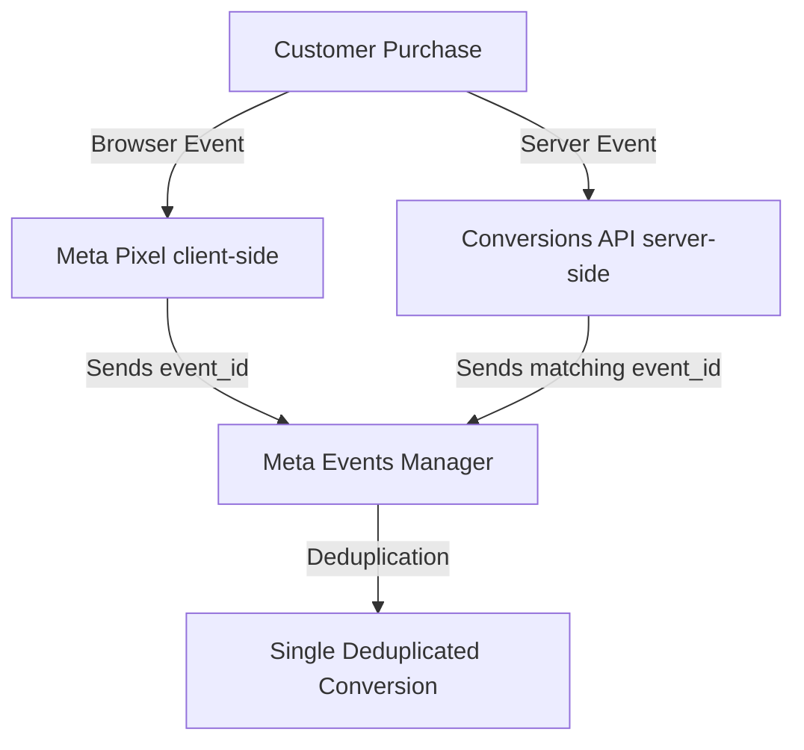

# Meta Conversions API & Catalog Guide for Marketers
*Target Audience: Marketing Team, Growth Hackers, and Ads Specialists*

Welcome to the **sundus.bd** Meta tracking architecture guide. This document details how our state-of-the-art tracking system is implemented, how it optimizes your ad spend, and how you can manage and verify it within **Meta Events Manager**.

---

## 🚀 1. The Architecture: Hybrid Tracking

To combat ad-blockers, browser tracking protections, and iOS 14+ limitations, we have implemented a **Hybrid Tracking System**. This system tracks conversions through two simultaneous channels:

1. **Client-Side (Meta Pixel)**: Tracks events directly in the customer's browser. It is fast and captures browser context, but can be blocked by ad-blockers or Safari's Intelligent Tracking Prevention (ITP).
2. **Server-Side (Conversions API - CAPI)**: Tracks events directly from our secure Node.js server. It is **100% unblockable** by browser extensions, ad-blockers, or VPNs, guaranteeing that every single transaction is reported to Meta.

---

## 🛡️ 2. Event Deduplication (Zero Double-Counting)

Because we trigger both a Pixel event and a CAPI event for a single purchase, Meta needs to know they represent the same transaction. 

We achieve **perfect deduplication** by attaching a unique, matching `eventID` to both events:
* **The Unique Key**: `purchase_{orderId}` (e.g. `purchase_202605191245`)
* **How Meta Handles It**: When Meta's servers receive the browser Pixel event and the CAPI server event with the **exact same `eventID`**, it automatically merges them, keeping only one conversion.
* **Why it's crucial**: This protects your ads reporting from double-counting sales, giving you accurate ROAS (Return on Ad Spend) metrics.

---

## 👥 3. Manual Advanced Matching (Hashed Customer Data)

To increase your Meta **Event Match Quality Score** (which directly improves custom audience sizing and retargeting precision), we send customer data points securely hashed using **SHA-256** (industry standard):

### What is sent client-side (Pixel):
* Email
* Phone number
* First Name & Last Name (automatically parsed from the full name field!)
* City
* Country (`bd`)

### What is sent server-side (CAPI):
* Hashed Email (`em`)
* Hashed Phone Number (`ph`)
* Client IP Address (`client_ip_address`)
* Client Browser User-Agent (`client_user_agent`)
* Unique External ID (`external_id` generated securely from hashed customer identifiers)

---

## 🛍️ 4. Dynamic Catalog Sync (Real-time Feed)

To power **Dynamic Product Ads (DPA)** and retarget users with the exact products they viewed or added to the cart, your Meta Pixel `content_ids` must perfectly match the `id` of the products in your Meta Commerce Catalog.

* **Pixel tracked ID**: Sends the MongoDB ObjectID `_id` (e.g., `69f78cb1f5c096a3f7b8a642`).
* **Live Catalog Feed**: We have created a dynamic XML feed at:
  👉 **`https://sundus.bd/api/products/facebook-feed?file=.xml`**
* **The Match**: This feed exports all active catalog items from the database with `<g:id>` mapped to the MongoDB `_id`, guaranteeing a **100% catalog match rate** and enabling dynamic retargeting without warnings.

---

## 🛠️ 5. Marketer's Guide: Steps to Verify in Meta Events Manager

Here is how you can verify and monitor this setup inside your Meta Business Account:

### A. How to check Event Match Quality
1. Go to **Meta Events Manager**.
2. Select your Pixel **SUNDUSBD**.
3. Under the **Overview** tab, look at the **Purchase** event.
4. Verify the **Event Match Quality Score**. It should be rated **Good** or **Excellent** because we are sending advanced matching customer parameters (email, phone, ip, name, city).

### B. How to check Deduplication Rate
1. Inside **Events Manager**, select the **Purchase** event.
2. Click **View Details**.
3. Look at the **Deduplication** status. It should show a high deduplication percentage (approaching 100%), confirming that Meta is successfully merging the browser and server events using the `eventID`.

### C. How to Test Events in Real-Time
To test the server-side integration without placing a real order:
1. Go to **Events Manager** -> **Test events** tab.
2. Under "Test server events", copy your **Test Event Code** (e.g., `TEST12345`).
3. If you want to route test events in development, add the test code to your server environment file (`.env.local`) under `META_TEST_EVENT_CODE`.
4. Run a checkout flow, and you will see the CAPI event instantly appear in the Meta Events Manager log with a "Server" label.

---

## 📋 6. Summary Checklist for Your Next Campaign Launch

- [ ] **Catalog Source**: Ensure your catalog data source is set to a **Scheduled Feed** pointing to:
  `https://sundus.bd/api/products/facebook-feed?file=.xml`
- [ ] **Pixel Setup**: Verify the client Pixel is active on `sundus.bd`.
- [ ] **Conversions API**: Confirm server-side Purchase tracking is active (triggered automatically upon any successful landing page order or standard checkout).
- [ ] **ROAS Tracking**: Verify that currency is reported correctly as **BDT** and purchase values exclude/include shipping fees according to your reporting preference.
